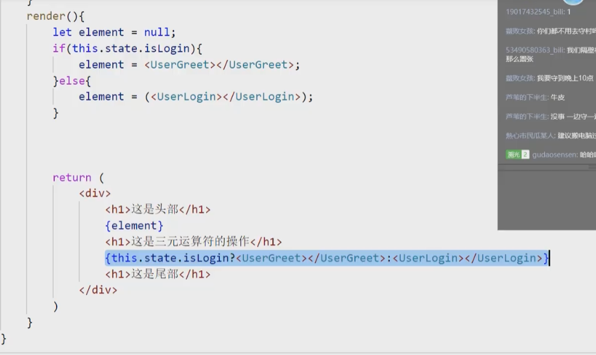
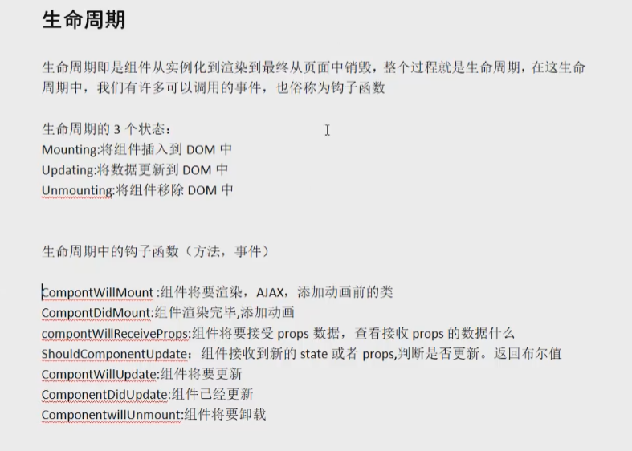
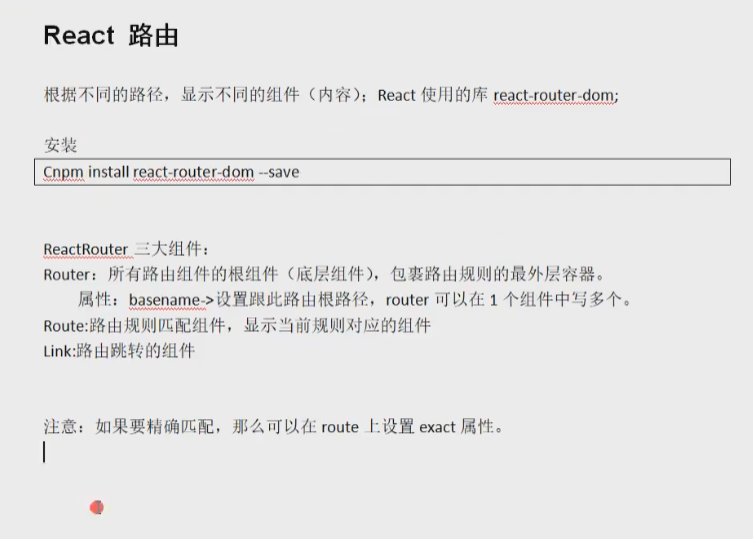
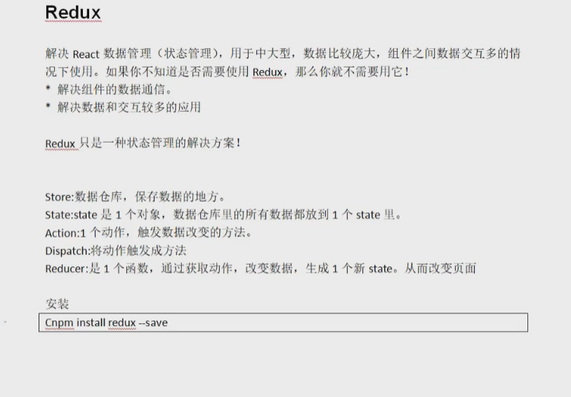
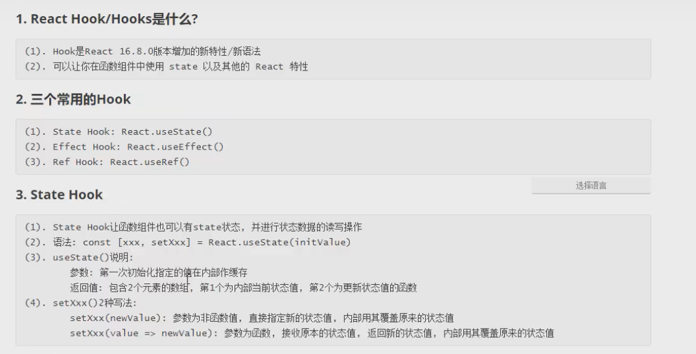
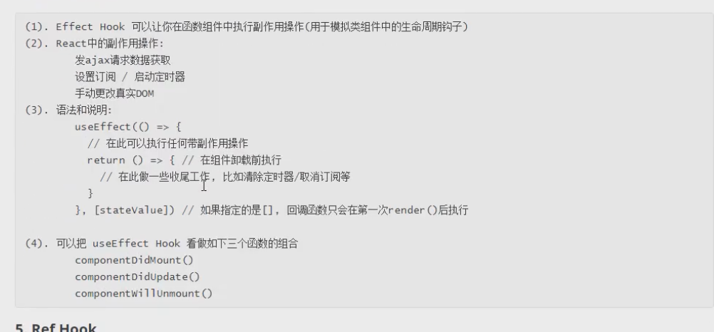
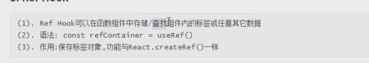
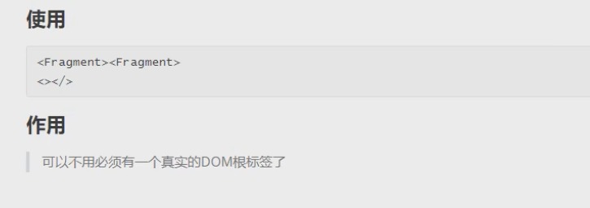
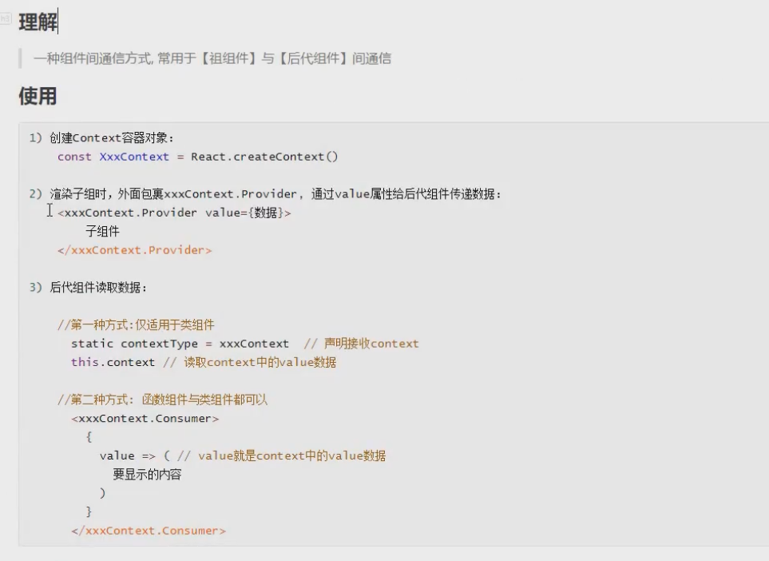

# React

安装 cnpm i serve -g  

 serve .\reactapp\

插件推荐:

​		Redux DevTools

​		React Developer Tools

安装模块

​		cnpm insatll antd --save


let const var 的区别

网站 https://www.cnblogs.com/zhaoxiaoying/p/9031890.html

UI 网站

https://material-ui.com/zh/

组件通信

https://blog.csdn.net/xingfuzhijianxia/article/details/86151243

**{} 为变量** 

**{{}} 为对象**

1、安装脚手架create react app

cnpm install -g create-react-app

2、创建项目

create-react-app  01app(项目名称且名称不能带有大写字母)

3、元素渲染

let h1 = <h1>nihao</h1>;

使用jsx的写法，可以创建js元素对象

注意：jsx元素对象，或者组件对象，必须只有一个根元素（根节点）

```jsx
//显示当前时间
function clock() {
  let time = new Date().toLocaleTimeString();
  //h1中必须只有一个根元素（当前h1中的根元素为<h1></h1>）
  let h1 = <h1>当前时间为{time}</h1>;
  ReactDOM.render(h1,document.getElementById("root"));
}
//调用clock
clock();
```

4、父子组件

```jsx
//父子组件的传值
//函数组件(必须大写开头Clocl)
function Clocl(props) {
  return (
    <div>
      <h1>当前的时间为{props.date.toLocaleTimeString()}</h1>
    </div>
  );
}
//组件Clocl
function run() {
  ReactDOM.render(<Clocl date={new Date()} />, document.getElementById("root"));
}
//每1000毫秒执行一次run
setInterval(run, 1000);
```

## React  jsx

优点：

1、jsx执行更快，编译JavaScript代码时进行优化

2、类型更安全，编译过程如果出错就不能编译，及时发现错误

3、jsx编写模板更加简单快速

注意点：

1、jsx必须要有跟节点

2、正常的普通HTML元素要小写，如果是大写，默认为是组件

## jsx表达式

### 总结

1、由HTML元素构成

2、中间如果需要插入变量用{}

3、{}中间可以使用表达式

4、{}中间表达式中可以使用**JSX**对象

5、属性和html内容一样都是用{}来插入内容

```jsx
//在jsx中{str + time} 可以完成拼接
let time = new Date().toLocaleDateString();
let str = "当前时间为:";
let el = (
  <div>
    <h1>{str + time}</h1>
  </div>
);
ReactDOM.render(el, document.getElementById("root"));
```

### 三元运算符

```jsx	
//{Boolean ? "生病" : "健康"}  可以完成三元运算符的操作
let str = "生病";
let el = (
  <div>
    <h1>{str === "生病" ? "请假" : "健康"}</h1>
  </div>
);
ReactDOM.render(el, document.getElementById("root"));
```

### html中的样式用className来命名


### jsx style样式

1、class中，不可以存在多个class属性

```jsx
<div class="abc" class ={'active'}></div> //错误表达式
```

2、style样式中，如果存在多个单词组合，第二个单词首字母大写

3、注释  

```jsx
//类组件中使用的style
let exampleStyle = { backgroundColor: "red" };
export default class Index extends Component {
    render() {
        return (
          <div style={exampleStyle}>
            {/**这里写注释 */}
            <h1>hello</h1>
          </div>
        );
    }
}
//函数组件使用的style
function Children() {
//样式
let color = {
  backgroundColor: "#5D90AB",
  borderRadius: "5px"
};
  let title = <h2>hello</h2>;
  let weather = "下雨";
  //条件判断
  let isGo = weather === "下雨" ? "不出门" : "出门";
  return (
    <div style={color}>
      {title}
      <h1>hello 函数式组件</h1>
      <span>{isGo}</span>
    </div>
  );
}
```

## react 组件

函数式组件与类组件的区别和使用，函数式比较简单，一般用于静态没有交互事件内容的组件页面。类组件，一般又称为动态组件，那么一般会有交互或者数据修改的操作

1、函数式组件

```jsx

```


2、类组件

3、复合组件：组件中又有其他的组件，复合组件中既可以有函数式组件又有类组件

## react state

相当于vue的data 但是使用方式跟vue不一致

## react props

#### 父传递给了子组件，单向流动，不能子传递给父

props可以设置默认值

HelloMessage.defaultProps={name:"hua",msg:"helloworld"}

注意：props可以传递函数，props可以传递父元素的函数，就可以去修改父元素的state

#### react数据 子传父

调用父元素的函数从而操作父元素的，从而实现数据从子元素传递至父元素

```jsx

//子传父
class PertenCom extends React.Component {
  constructor(props) {
    super(props);
    this.state = {
      childrenData: "",
    };
  }
  render() {
    return (
      <div>
        <h1>子元素传给父的数据:{this.state.childrenData}</h1>
        <ChildCom setChildData={this.setChildData} />
      </div>
    );
  }
  setChildData = (data) => {
    console.log(data);
    this.setState({
      childrenData: data,
    });
  };
}
export default PertenCom;

class ChildCom extends React.Component {
  constructor(props) {
    super(props);
    this.state = { msg: "hello" };
  }
  render() {
    return (
      <div>
        {/**方式一*/}
        <button onClick={this.sendData}>传递hello给父元素</button>
        {/**方式二 */}
        <button
          onClick={() => {
            this.props.setChildData("直接返回给父元素的内容");
          }}
        >
          直接返回给父元素的内容
        </button>
      </div>
    );
  }
  //箭头函数就不需要bind进行绑定了
  //箭头函数为es6特性
  sendData = () => {
    //将元素传递给到父元素，实际就是调用父元素传递进来的父元素函数
    // console.log(this.state.msg);
    this.props.setChildData(this.state.msg);
  };
}

ReactDOM.render(<PertenCom />, document.getElementById("root"));
```

## react 事件

特点：

1、react事件，绑定事件的命名，驼峰命名法

2、{}，传入1个函数，而不是字符串

事件对象：react返回的事件对象是代理的原生的事件对象，如果想要查看事件对象的具体值，必须输出事件对象的属性

原生，阻止默认行为时，可以直接返回return false

react中，阻止默认必须用e.preventDefault();

```jsx
class PerentCom extends React.Component {
  constructor(props) {
    super(props);
    this.state = {};
  }
  render() {
    return (
      <div>
        <form action="http://www.baidu.com">
          <div className="child">
            {" "}
            <h1>hello</h1>
            <button onClick={this.parentEvent}>提交</button>
          </div>
        </form>
        {/**使用箭头函数传递多个参数的方式*/}
        <button
          onClick={(e) => {
            this.parentEvent1("msg:hello", e);
          }}
        >
          提交
        </button>
        {/**不使用es6箭头函数传递多个参数的方式,需要使用bind进行绑定*/}
        <button
          onClick={function (e) {
            this.parentEvent1("msg:hello", e);
          }.bind(this)}
        >
          提交
        </button>
      </div>
    );
  }
  parentEvent = (e) => {
    e.preventDefault();
    console.log(e);
  };
  parentEvent1 = (msg, e) => {
    console.log(msg);
  };
}

export default PerentCom;
ReactDOM.render(<PerentCom />, document.getElementById("root"));
```

2、函数组件事件触发

```jsx
//  <Demo1/>
function Demo1() {
  const ele = () => {
    console.log("hello");
  }
  return (
    <div>
      <Button onClick={ele}>按钮1</Button>
    </div>
  );
}
```


## react 条件渲染

react中条件渲染和JavaScript中，条件运算，if。。。。else  三元运算符



## react 列表渲染

将列表内容拼接成数组放置到模板中，将数据拼接成数组的jsx对象，使用数组的map方法，对每一项数据按照jsx的形式进行加工，最终得到1个每一项都是jsx对象的数组，再将数组渲染到模板中，key值需要放置到每一项中

## react生命周期



## 表单输入

注意：必须绑定value值和onChange事件

## react插槽

组件中写入内容，这些内容可以被识别和控制，react需要自己开发支持插槽功能

原理：

组件中写入的html，可以传入到props中

## react路由

1、cnpm install react-router-dom --save



**案例**

```jsx
import React from "react";
import ReactDOM from "react-dom";
import reportWebVitals from "./reportWebVitals";
import {BrowserRouter as Router, Route, Link } from "react-router-dom";

//route 开发
function Home() {
  return (
    <div><h1>首页</h1></div>
  );
}

function Produce() {
  return (
    <div>
      <h1>Produce</h1>
    </div>
  );
}

function Me(props) {
  console.log(props);
  return (
    <div>
      <h1>Me</h1>
    </div>
  );
}

function News(props) {
  console.log(props);
  return (
    <div>
      <h1>news:{props.match.params.id }</h1>
    </div>
  );
}
class App extends React.Component {
  constructor(props) {
    super(props);
    this.state = {  }
  }
  render() {
    return (
      <div>
        {/*  basename为路径默认的根添加一个admin*/}
        <Router basename="/admin">
          <div>
            {/* link中还有其他的属性 如 replace */}
            <Link to="/">Home</Link>
            <Link to="/produce">Produce</Link>
            <Link to="/me">个人中心</Link>
            {/* 将234524传入 News组将中的props中 */}
            <Link to="/new/234524">新闻</Link>
          </div>
          {/* route显示对应link中组件内容 */}
          <Route path="/" exact component={Home}></Route>
          <Route path="/produce" exact component={Produce}></Route>
          <Route path="/me" exact component={Me}></Route>
          <Route path="/new/:id" exact component={News}></Route>
        </Router>
      </div>
    );
  }
}

export default App;
ReactDOM.render(<App/>,document.getElementById("root"))
reportWebVitals();

```

## 重定向组件

如果访问某个组件时，如果


## Redux

1、cnpm install redux --save



2、创建 reduxcer.js

```jsx
const defaultState = {
    inputValue: "",
    listValue: ["one",
        "two", "three"]
}
//actions 就是一个对象，；例如{type："",data:}
export default (state = defaultState, actions) => {
    // console.log("actions",actions)
    // state不能直接使用，
    let newState
    switch (actions.type) {
        case "add":
            console.log(actions)
             newState = JSON.parse(JSON.stringify(state));
            if (actions.data === "") {
                return state;
            }
            newState.listValue.push(actions.data)
            newState.inputValue=""
            return newState;
            break;
        case "del":
             newState = JSON.parse(JSON.stringify(state));
            if (actions.data === "") {
                return state;
            }
            newState.listValue.splice(actions.index,1)
            return newState;
        default:
            return state;
    }
}

```

3、创建store.js

```jsx
import {createStore} from "redux"
import reduxcer from "../reducer/reduxcer"
const store=createStore(
    reduxcer,

)
export default store;

```

4、index.js

```jsx
import React, {Component} from 'react';
import store from "./reducer/store"
import {Button, List} from "antd"
import "antd/dist/antd.css"
import "./style.css"
class Index extends Component {
    ListClickHandler = (index) => {
        //console.log(index)
        store.dispatch({type: "del", index})
    }


    constructor(props) {
        super(props);
        this.state = store.getState();
        store.subscribe(() => {
            this.setState(store.getState())
        })
    }

    changValue = (event) => {
        // console.log(event.target.value)
        this.state.inputValue = event.target.value;
        //  store.dispatch({type: "", data: this.state.inputValue})
    }

    Click = () => {
        console.log(this.state.inputValue)
        store.dispatch({type: "add", data: this.state.inputValue})
    }


    render() {
        return (
            <div>
                <div style={{margin: "10px",position: "0px"}}>
                    <input placeholder="请输入" onChange={this.changValue}/>
                    <Button onClick={this.Click} type="primary">增加</Button>
                </div>
                <div style={{margin: "10px", width: "300px"}}>
                    <List
                        bordered
                        dataSource={this.state.listValue}
                        renderItem={(item, index) => (
                            <List.Item onClick={this.ListClickHandler.bind(this, index)}>
                                {item}
                            </List.Item>
                        )}
                    />
                    <p className="hao">jihad</p>
                    <p className="ni">好</p>
                </div>
            </div>
        );
    }
}

export default Index;

```

## react-redux

1、reduxcer.js

```jsx
const defaultState = {
    inputValue: "",
    data: []
}

export default (state = defaultState, action) => {

    if (action.type === "change") {
        const newState = JSON.parse(JSON.stringify(state));
        newState.inputValue = action.inputValue;
        console.log("newState",newState)
        return newState;
    }
    if(action.type === "submit"){
        const newState = JSON.parse(JSON.stringify(state));
        newState.data.push(state.inputValue);
        if(newState.inputValue ===""){
            return state;
        }
        newState.data.push(new Date().toLocaleDateString());
        console.log("newstate.data",newState.data)
        newState.inputValue=""
        return newState;
    }

    return state;
}


```

2、store.js

```jsx
import {createStore} from "redux"
import reducer from "./reduxcer"

const store = createStore(reducer)
export default store;

```

3、index.js

```jsx
import React, {Component} from 'react';
import {connect} from "react-redux"

class Index extends Component {

    render() {
        return (

            <div>
                <input onChange={this.props.changeHandler}/>
                <button onClick={this.props.clickHandler}>add</button>
                <ul>
                    {
                        this.props.data.map((item, index) => {
                            return (<li key={index}>{item}</li>)
                        })
                    }
                </ul>
            </div>

        );
    }
}

const stateToProps = (state) => {
    return {
        inputValue: state.inputValue,
        data: state.data
    }
}
const dispatchToProps = (dispatch) => {
    return {
        changeHandler(event) {
            let action = {
                type: "change",
                inputValue: event.target.value,
            }
            dispatch(action)
        },
        clickHandler() {
            console.log("11")
            let action = {
                type: 'submit'
            }
            dispatch(action)
        }
    }
}

export default connect(stateToProps, dispatchToProps)(Index);

```

4、根组件

```jsx
import React, {Component} from 'react';
import ReactDOM from "react-dom";
import {Provider} from "react-redux"
import Index from "./day0802/index"
import store from "./day0802/reduxcer/store"


class Parent extends Component {
    render() {
        return (<div>
                <Provider store={store}>
                    <div>
                        <Index/>
                        <div></div>
                    </div>
                </Provider>
            </div>
        );
    }
}


// <Provider store={store}>
// <Index1/>
// </Provider>

ReactDOM.render(<Parent/>, document.getElementById("root"));

```


## 扩展

### setState


### lazyLoad

### Hooks

1、state hook



2、effect hook



3、ref hook



### Fragment



### Context

一般采用react-redux来实现



### 组件优化

### render props

### 错误边界

### 组件通信方式总结