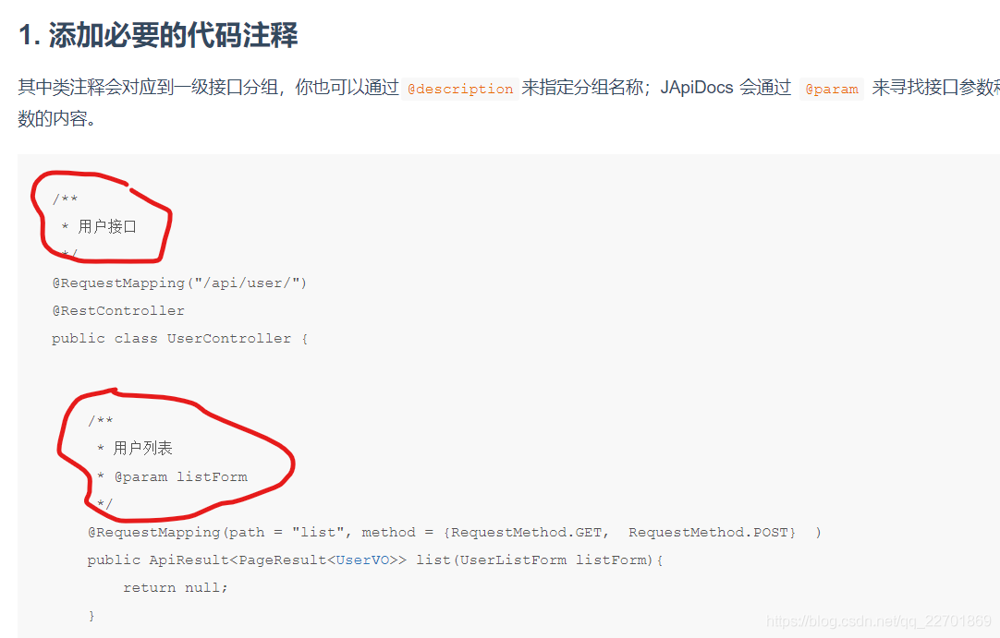
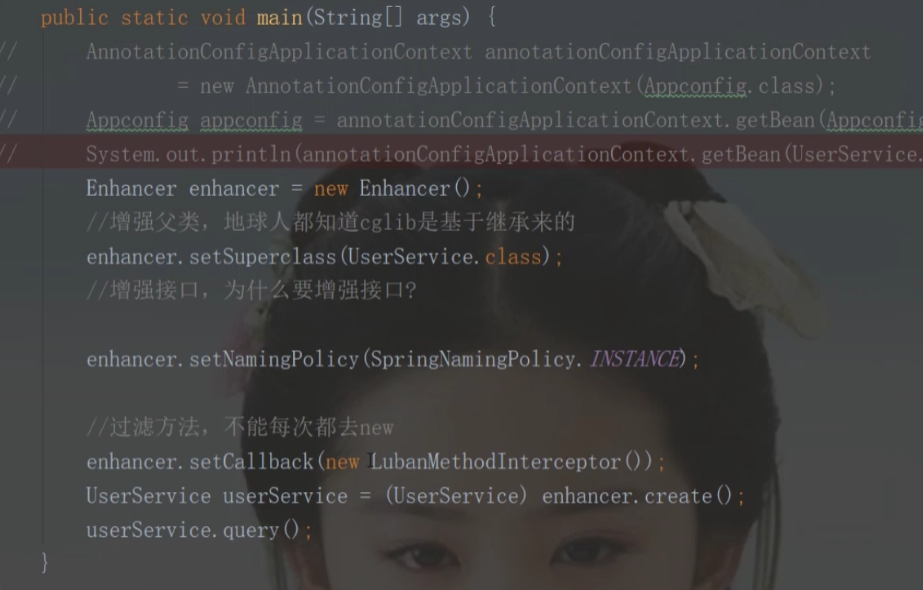
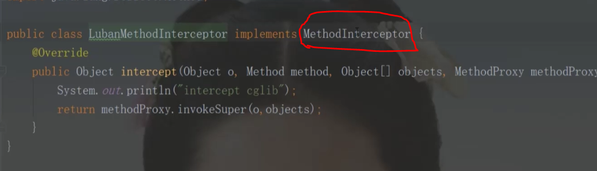
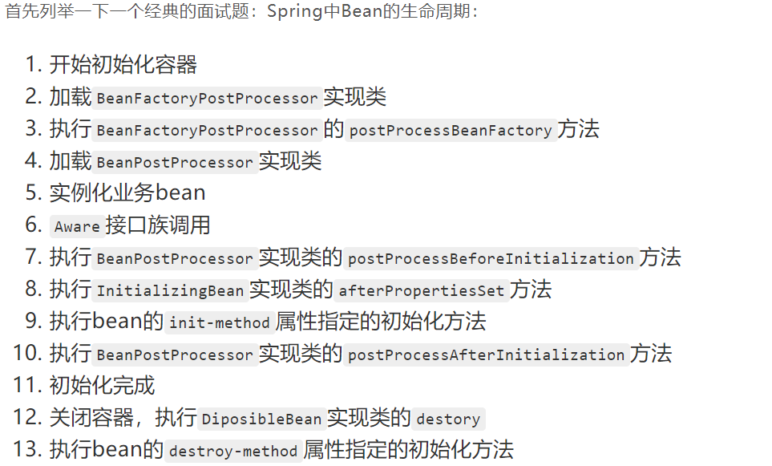

[TOC]


环境：jdk1.80_231

# 一、Springboot JPA中的关联查询


# 二、Mybatis


# 三、Rabbitmq

参考网址： https://blog.csdn.net/hellozpc/article/details/81436980 

[视频](<https://www.bilibili.com/video/av78225169?p=100>)

卸载需要注册表删除

## 3.1 工作模式

### 3.1.1 work queue（工作队列模式）

work queue：两个消费端共同消费同一个队列中的消息，它的特点如下：

一个生产者将消息发给一个队列 多个消费者共同监听一个队列的消息

**消息不能被重复消费**

rabbit采用**轮询**的方式将消息平均发送给消费者

### 3.1.2  Publish / Subscribe ( 发布/订阅模式)


# 四、springboot

## 4.1 @RequestParam和@PathVariable的区别

 <font color=#0099ff > @RequestParam和@PathVariable  </font>

>  相同点与区别

 @RequestParam和@PathVariable都能够完成类似的功能——因为本质上，它们都是用户的输入，只不过输入的部分不同，一个在URL路径部分，另一个在参数部分。要访问一篇博客文章，这两种URL设计都是可以的：

- 通过@PathVariable，例如/blogs/1
- 通过@RequestParam，例如blogs?blogId=1

那么究竟应该选择哪一种呢？建议：

1、当URL指向的是某一具体业务资源（或资源列表），例如博客，用户时，使用@PathVariable

2、当URL需要对资源或者资源列表进行过滤，筛选时，用@RequestParam

例如我们会这样设计URL：

- /blogs/{blogId}
- /blogs?state=publish    而不是/blogs/state/publish来表示处于发布状态的博客文章

> 更多用法

 一旦我们在方法中定义了@RequestParam变量，如果访问的URL中不带有相应的参数，就会抛出异常——这是显然的，Spring尝试帮我们进行绑定，然而没有成功。但有的时候，参数确实不一定永远都存在，这时我们可以通过定义required属性：

```java
@RequestParam(value = "id", required = false)
```

当然，在参数不存在的情况下，可能希望变量有一个默认值：

```java
@RequestParam(value = "id", required = false, defaultValue = "0")
```

# 五、springbootAOP  

​	参考网站 https://www.bilibili.com/video/BV1KT4y1G7hs?from=search&seid=2723361983515545802

### 1、pom文件 dependencies 部分的内容

```xml
  <dependencies>

        <dependency>
            <groupId>org.springframework.boot</groupId>
            <artifactId>spring-boot-starter-web</artifactId>
        </dependency>
        <dependency>
            <groupId>org.springframework.security</groupId>
            <artifactId>spring-security-web</artifactId>
            <version>5.3.4.RELEASE</version>
        </dependency>
        <dependency>
            <groupId>org.springframework.boot</groupId>
            <artifactId>spring-boot-test</artifactId>
            <scope>test</scope>
        </dependency>
        <dependency>
            <groupId>org.springframework.boot</groupId>
            <artifactId>spring-boot-starter-aop</artifactId>
        </dependency>
      <!--热部署-->
		<dependency>
			<groupId>org.springframework.boot</groupId>
			<artifactId>spring-boot-devtools</artifactId>
			<optional>true</optional>
		</dependency>

    </dependencies>
<!--打包-->
<build>
		<plugins>
			<plugin>
				<groupId>org.springframework.boot</groupId>
				<artifactId>spring-boot-maven-plugin</artifactId>
				<configuration>
					<fork>true</fork>
				</configuration>
			</plugin>
		</plugins>
	</build>
```

### 2、五种常见的通知 5种Advice(通知)

​	前置通知：在我们执行目标方法之前运行（@before）

​	后置通知：	在我们执行目标方法运行结束之后，不管有没有异常（@after）

​	返回通知：在我们的目标方法正常返回值之后运行（@afterReturning）

​	异常通知：在我们的目标方法出现<font color=#ee11111>异常后运行</font>（@afterThrowing）

​	环绕通知：动态代理，需要手动执行joinPoint.procced（）（其实就是我们的目标方法执行之前相当于前置通		知，执行之后就相当于后置通知）

### 3、excution表达式

具体详情内容参考    [网址](https://blog.csdn.net/ABCD898989/article/details/50809321?utm_medium=distribute.pc_relevant.none-task-blog-BlogCommendFromMachineLearnPai2-3.channel_param&depth_1-utm_source=distribute.pc_relevant.none-task-blog-BlogCommendFromMachineLearnPai2-3.channel_param)

```java
在使用spring框架配置AOP的时候，不管是通过XML配置文件还是注解的方式都需要定义pointcut"切入点"

例如定义切入点表达式 execution(* com.sample.service.impl..*.*(..))
execution()是最常用的切点函数，其语法如下所示：
 整个表达式可以分为五个部分：
 1、execution(): 表达式主体。

 2、第一个*号：表示返回类型，*号表示所有的类型。

 3、包名：表示需要拦截的包名，后面的两个句点表示当前包和当前包的所有子包，com.sample.service.impl包、子孙包下所有类的方法。

 4、第二个*号：表示类名，*号表示所有的类。

 5、*(..):最后这个星号表示方法名，*号表示所有的方法，后面括弧里面表示方法的参数，两个句点表示任何参数。
```

# 六、springboot中使用redis的内容

pom.xml

```java
		<dependency>
            <groupId>org.springframework.boot</groupId>
            <artifactId>spring-boot-starter-data-redis</artifactId>
        </dependency>  
```

### properties配置文件配置redis信息

```java
# Redis数据库索引（默认为0）
spring.redis.database=0
# Redis服务器地址
spring.redis.host=127.0.0.1
# Redis服务器连接端口
spring.redis.port=6379
# Redis服务器连接密码（默认为空）
spring.redis.password=
# 连接池最大连接数（使用负值表示没有限制）
spring.redis.jedis.pool.max-active=20
# 连接池最大阻塞等待时间（使用负值表示没有限制）
spring.redis.jedis.pool.max-wait=-1
# 连接池中的最大空闲连接
spring.redis.jedis.pool.max-idle=10
# 连接池中的最小空闲连接
spring.redis.jedis.pool.min-idle=0
# 连接超时时间（毫秒）
spring.redis.timeout=1000
```

将java对象与redis中的string之间的转化（使用**fastjson**）

​	https://www.cnblogs.com/ibigboy/p/11124524.html


# 七、spring中的事务

https://blog.csdn.net/gaopp_2017/article/details/90519552


```java

import org.springframework.beans.factory.annotation.Autowired;
import org.springframework.stereotype.Service;
import org.springframework.transaction.annotation.Isolation;
import org.springframework.transaction.annotation.Propagation;
import org.springframework.transaction.annotation.Transactional;

@Service("bookShopService")
public class BookShopServiceImpl implements BookShopService {

    @Autowired
    private BookShopDao bookShopDao;
   
    /**
     * 1.添加事务注解 @Transactional (该注解可设置以下的属性)
     * 使用propagation 指定事务的传播行为，即当前的事务方法被另外一个事务方法调用时如何使用事务。
     * 默认取值为REQUIRED，即使用调用方法的事务
     * REQUIRES_NEW：使用自己的事务，调用的事务方法的事务被挂起。
     *
     * 2.使用isolation 指定事务的隔离级别，最常用的取值为READ_COMMITTED
     * 3.默认情况下 Spring 的声明式事务对所有的运行时异常进行回滚，也可以通过对应的属性进行设置。通常情况下，默认值即可。
     * 4.使用readOnly 指定事务是否为只读。 表示这个事务只读取数据但不更新数据，这样可以帮助数据库引擎优化事务。若真的是一个只读取数据库值得方法，应设置readOnly=true
     * 5.使用timeOut 指定强制回滚之前事务可以占用的时间。
     */
    @Transactional(propagation=Propagation.REQUIRES_NEW,
            isolation=Isolation.READ_COMMITTED,
            noRollbackFor={UserAccountException.class},
            readOnly=true, timeout=3)
    @Override
    public void purchase(String username, String isbn) {
        //1.获取书的单价
        int price = bookShopDao.findBookPriceByIsbn(isbn);
        //2.更新书的库存
        bookShopDao.updateBookStock(isbn);
        //3.更新用户余额
        bookShopDao.updateUserAccount(username, price);;
    }
}

```

# 八、JApiDocs

## 导包

```xml
<dependency>
  <groupId>io.github.yedaxia</groupId>
  <artifactId>japidocs</artifactId>
  <version>1.4.3</version>
</dependency>
```

## 添加注释



## 执行main函数

```java

@SpringBootApplication
public class Application {
    private static final Logger logger = LoggerFactory.getLogger(Application.class);
    public static void main(String[] args) {
        logger.info("nihao");
        SpringApplication.run(Application.class, args);
        logger.error("报错了");
        logger.debug("debug");

        //japidocs

        DocsConfig config = new DocsConfig();
        config.setProjectPath(
                "C:\\2Code\\2BackendCode\\springboot-mongodb\\springboot-mongodb\\src\\main"); // 项目根目录
        config.setProjectName("test"); // 项目名称
        config.setApiVersion("V1.0");      // 声明该API的版本
        config.setDocsPath("C:\\test\\apidoc"); // 生成API 文档所在目录
        config.setAutoGenerate(Boolean.TRUE);  // 配置自动生成
        Docs.buildHtmlDocs(config); // 执行生成文档

    }
}

```


# 九、日志的配置

## 1、logback-spring.xml配置详解

```xml
<?xml version="1.0" encoding="UTF-8"?>
<configuration>
    <!-- 日志存放路径 -->
    <property name="log.path" value="../logs" />
    <!-- 日志输出格式    --> <!--格式化输出：%d表示日期，%thread表示线程名，%-5level：级别从左显示5个字符宽度%msg：日志消息，%n是换行符 -->
    <property name="log.pattern" value="%d{yyyy-MM-dd HH:mm:ss.SSS} ==> [%thread] %-5level ==> %logger{30} ==> [%method,%line] ==> %msg%n" />

    <!-- 控制台输出 -->
    <appender name="console" class="ch.qos.logback.core.ConsoleAppender">
        <encoder>
            <pattern>${log.pattern}</pattern>
        </encoder>
    </appender>

    <!-- 系统日志输出 -->
    <appender name="file_info" class="ch.qos.logback.core.rolling.RollingFileAppender">
        <file>${log.path}/sys-info.log</file>
        <!-- 循环政策：基于时间创建日志文件 -->
        <rollingPolicy class="ch.qos.logback.core.rolling.TimeBasedRollingPolicy">
            <!-- 日志文件名格式 -->
            <fileNamePattern>${log.path}/sys-info.%d{yyyy-MM-dd}.log</fileNamePattern>
            <!-- 日志最大的历史 60天 -->
            <maxHistory>60</maxHistory>
        </rollingPolicy>
        <encoder>
            <pattern>${log.pattern}</pattern>
        </encoder>
        <filter class="ch.qos.logback.classic.filter.LevelFilter">
            <!-- 过滤的级别 -->
            <level>INFO</level>
            <!-- 匹配时的操作：接收（记录） -->
            <onMatch>ACCEPT</onMatch>
            <!-- 不匹配时的操作：拒绝（不记录） -->
            <onMismatch>DENY</onMismatch>
        </filter>
    </appender>

    <appender name="file_error" class="ch.qos.logback.core.rolling.RollingFileAppender">
        <file>${log.path}/sys-error.log</file>
        <!-- 循环政策：基于时间创建日志文件 -->
        <rollingPolicy class="ch.qos.logback.core.rolling.TimeBasedRollingPolicy">
            <!-- 日志文件名格式 -->
            <fileNamePattern>${log.path}/sys-error.%d{yyyy-MM-dd}.log</fileNamePattern>
            <!-- 日志最大的历史 60天 -->
            <maxHistory>60</maxHistory>
        </rollingPolicy>
        <encoder>
            <pattern>${log.pattern}</pattern>
        </encoder>
        <filter class="ch.qos.logback.classic.filter.LevelFilter">
            <!-- 过滤的级别 -->
            <level>ERROR</level>
            <!-- 匹配时的操作：接收（记录） -->
            <onMatch>ACCEPT</onMatch>
            <!-- 不匹配时的操作：拒绝（不记录） -->
            <onMismatch>DENY</onMismatch>
        </filter>
    </appender>

    <!-- 用户访问日志输出  -->
    <appender name="sys-user" class="ch.qos.logback.core.rolling.RollingFileAppender">
        <file>${log.path}/sys-user.log</file>
        <rollingPolicy class="ch.qos.logback.core.rolling.TimeBasedRollingPolicy">
            <!-- 按天回滚 daily -->
            <fileNamePattern>${log.path}/sys-user.%d{yyyy-MM-dd}.log</fileNamePattern>
            <!-- 日志最大的历史 60天 -->
            <maxHistory>60</maxHistory>
        </rollingPolicy>
        <encoder>
            <pattern>${log.pattern}</pattern>
        </encoder>
    </appender>

    <!-- 系统模块日志级别控制  -->
    <logger name="cn.itcast.springboot" level="info" />
    <!-- Spring日志级别控制  -->
    <logger name="org.springframework" level="warn" />

    <root level="info">
        <appender-ref ref="console" />
    </root>

    <!--系统操作日志-->
    <root level="info">
        <appender-ref ref="file_info" />
        <appender-ref ref="file_error" />
    </root>

    <!--系统用户操作日志-->
    <logger name="sys-user" level="info">
        <appender-ref ref="sys-user"/>
    </logger>
</configuration>
```


# 十、spring-cglib

大致的实现

# 




实现时重要的类ConfigurationClassEnhancer中的判断

# 布隆过滤器

 https://blog.csdn.net/ttaannkkee/article/details/102502921

# springboot杂谈

1、通信无状态链接 http rest   弊端：<font color=#ee1111 >每请求占一个连接</font>

2、Springboot 如何为 API 添加统一路径前缀，类似 /api/v2/**这种，不使用 server.servlet.context-path，这个是控制整个项目的，不使用Nginx，不使用getway

```java
实现 WebMvcConfigurer 接口的 configurePathMatch 接口
@Override
public void configurePathMatch(PathMatchConfigurer configurer) {
configurer.addPathPrefix("/api", c -> c.isAnnotationPresent(RestController.class) || c.isAnnotationPresent(Controller.class));
}
```


# springboot源码

## 1、spring中bean的生命周期

aware为通知的意思



## 2、springboot中的run执行顺序

**以参考网站为准** https://www.jianshu.com/p/a46392c5cc50

**组装SpringApplication**

1.resourceLoader：设置resourceload
 2.设置primarySources：可以把启动类加载进入spring容器
 3.webApplicationType：判断当前application应该运行在什么环境下
 4.mainApplicationClass：找出main方法启动的class

**执行SpringApplication的run方法**

**获取SpringApplicationRunListeners**

1.从META-INF/spring.factories获取SpringApplicationRunListener的集合，并依次调用的SpringApplicationRunListener的starting方法---即最终调用ApplicationListener的onApplicationEvent方法，发布springboot启动事件

**prepareEnvironment（目前profile功能已经被maven取代了）**

1.ConfigurableEnvironment：代表两种意义：一种是profiles，用来描述哪些bean definitions是可用的；一种是properties，用来描述系统的配置，其来源可能是配置文件、JVM属性文件、操作系统环境变量等等
 2.getOrCreateEnvironment()：根据webApplicationType创建不同的Environment
 3.configureEnvironment(XX)：通过configurePropertySources(environment, args)设置properties，通过configureProfiles(environment, args)设置profiles
 4.listeners.environmentPrepared(environment);发布environmentPrepared事件，即调用ApplicationListener的onApplicationEvent事件

1. bindToSpringApplication：即把当前的environment和当前的springApplication绑定
    6.ConfigurationPropertySources.attach(environment)：将ConfigurationPropertySource放入environment的propertysource中的第一个

**createApplicationContext：创建spring的容器**

1.根据不同的webApplicationType设置不同的contextClass（容器的class类型），然后生成不同的容器实例对象
2.生成容器实例的时候，对于Kotlin类使用'primary'构造函数实例化一个类，如果不是就使用默认构造函数，根据得到构造函数生成实例对象，如果构造函数不是公共的，我们尝试去改变并访问

**prepareContext:准备容器，在准备刷新容器前准备好容器**

 1.context.setEnvironment(environment)：设置spring容器的environment
 2.postProcessApplicationContext(context)：设置beanNameGenerator和resourceLoader
 3.applyInitializers(context)：调用ApplicationContextInitializer的initialize来初始化context，其中还检测各个ApplicationContextInitializer是否接受该类型的容器
 4.listeners.contextPrepared(context);即调用SpringApplicationRunListener的contextPrepared方法，但目前是个空实现。
 5.分别注册springApplicationArguments和springBootBanner这两个bean
 6.getAllSources就是获取我们的primarySources和sources
 7.load(context, sources.toArray(new Object[0]))：首先创建BeanDefinitionLoader，设置该loader的sources，annotatedReader，xmlReader，scanner，以及添加scanner的ExcludeFilter（即过滤springboot的启动类），若用户启动的时候设置了beanNameGenerator，resourceLoader，environment的话就替代我们自身设置的属性。同时根据source的类型选择不同的load方法，这边我们是load（class），最终判断是否是component注解，是的话就通过annotatedReader将启动类注册成bean
 8.listeners.contextLoaded(context):首先判断ApplicationListener是否属于ApplicationContextAware，如果是的话就将spring容器赋值给该listener，然后将该ApplicationListener赋值给spring容器，然后调用ApplicationListener的onApplicationEvent方法

**refreshContext(context)：真正的刷新spring容器**

**一.refresh(context)：**
 1.prepareRefresh():设置些初始的操作比如，开启激活，启动日期，初始化propertySource。
 2.获取beanFactory
 3.prepareBeanFactory(beanFactory)：设置beanFactory的classloader，BeanExpressionResolver，PropertyEditorRegistrar，ApplicationContextAwareProcessor和忽略xxxxAware，注册依赖，还有ApplicationListenerDetector
 ApplicationContextAwareProcessor：只是将applicationContext传递给ApplicationContextAwareProcessor，方便后面的xxxAware调用
 忽略xxxxAware：忽略这些Aware接口实现类中与接口set方法中入参类型相同的属性的的自动注入这样就保证了关键的类是由spring容器自己产生的而不是我们注入的，

自动注入不是指的@AutoWire 而是指的是beans的default-autowire="byType" 或在bean的autowire="byType" ，这样spring 回去ioc容器寻找类型相似的类型给其注入，如果实现了spring 的xxaware接口，就不会自动注入记载filterPropertyDescriptorsForDependencyCheck删除与入参类型相同的属性

注册依赖：即指定一些类自动注入的实例是spring指定的实例对象
 ApplicationListenerDetector：检测实现了ApplicationListener的实现类，因为有些实现类，无法通过getBeanNamesForType获取到。
 4.postProcessBeanFactory(beanFactory)：继续设置ignoreDependencyInterface（ServletContextAware）还有annotatedClasses，basePackages如果存在就设置。
 5.invokeBeanFactoryPostProcessors(beanFactory)：从beanFactoryPostProcessors获取BeanFactoryPostProcessor，然后先执行BeanDefinitionRegistryPostProcessor类型的postProcessBeanDefinitionRegistry，继续从beanFactory获取BeanDefinitionRegistryPostProcessor类型的bean然后执行postProcessBeanDefinitionRegistry，执行的过程按照PriorityOrdered，Ordered，普通的类型进行执行，然后优先执行registryProcessors的postProcessBeanFactory在执行regularPostProcessors的postProcessBeanFactory，再从BeanFactory获取PriorityOrdered，Ordered，普通的类型三种类型的BeanFactoryPostProcessor，并按照顺序执行。总结：从之前加入的beanFactoryPostProcessor先执行postProcessBeanDefinitionRegistry（假如是BeanDefinitionRegistryPostProcessor）然后在执行postProcessBeanFactory方法，然后从beanFactory获取BeanFactoryPostProcessor 然后执行postProcessBeanFactory，执行过程中都要按照PriorityOrdered，Ordered，普通的类型三种类型的顺序执行。
 6.registerBeanPostProcessors：从beanFactory获取BeanPostProcessor分别按照PriorityOrdered，Ordered，普通的类型注册BeanPostProcessor
 7.BeanPostProcessor和BeanFactoryPostProcessor:前者是对bean初始化前后进行设置，后者可以对beanFactory进行修改 或者，可以对beanDefinition进行修改或者增加或者初始化渴望提前初始化的bean
 8.initMessageSource()：一般是我们用来初始化我们国际化文件的
 9.initApplicationEventMulticaster():设置applicationEventMulticaster，spring发布各种事件就依靠他，这个和springboot发布事件使用相同的类
 10.onRefresh()：初始化其他的子容器类中的bean，同时创建spring的内置tomcat，这在后期Springboot内嵌式tomcat中详细阐述
 11.registerListeners()：添加用户设置applicationListeners，然后从beanFactory获取ApplicationListener，然后发布需要earlyApplicationEvents事件
 12.finishBeanFactoryInitialization(beanFactory)：实例化非懒加载的剩余bean
 13.finishRefresh：清理资源缓存，初始化lifecycle，调用lifecycle的onrefresh，发布ContextRefreshedEvent的事件,激活JMX,启动tomcat

 **二.context.registerShutdownHook()：**

注册一个线程，该线程主要指向doclose方法，doClose方法的逻辑就是：从applicationContexts集合中删除当前容器，MBeanServer卸载MBean，发布容器关闭事件，调用了实现了lifecycleProcessor接口的bean，destroyBeans，closeBeanFactory，onClose：关闭内置tomcat，active设置为false

afterRefresh(context, applicationArguments)：目前是空的实现

listeners.started(context)：发布started事件

callRunners(context, applicationArguments)

1.从spring容器中获取ApplicationRunner和CommandLineRunner对象，然后按照顺序排序，循环调用他们的run方法

handleRunFailure(context, ex, exceptionReporters, listeners)

1.处理不同的异常状态，然后调用listeners.failed(context, exception)，并关闭spring容器

listeners.running(context)：发布running事件

