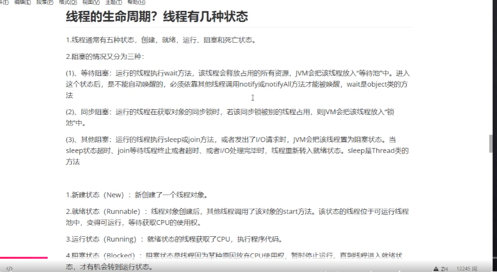
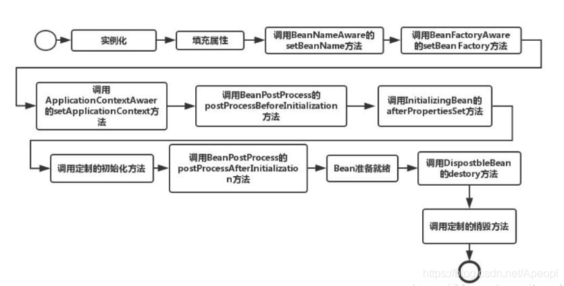
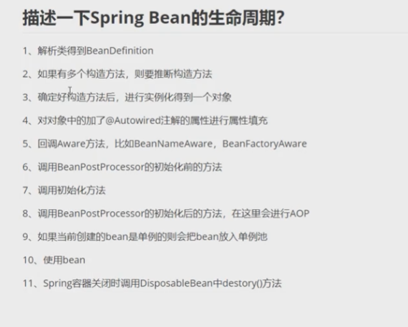
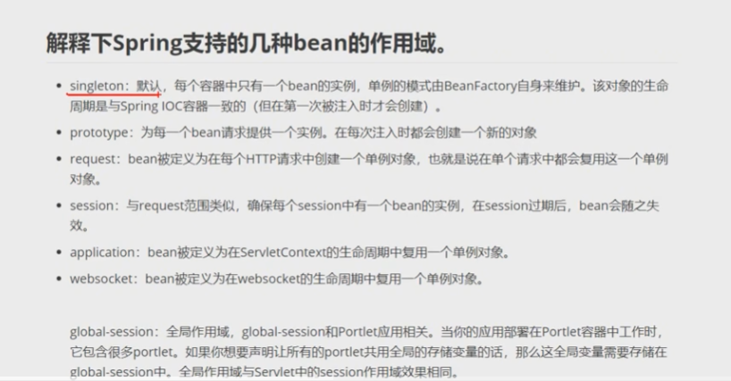
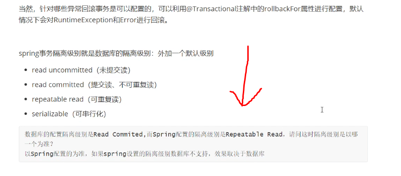
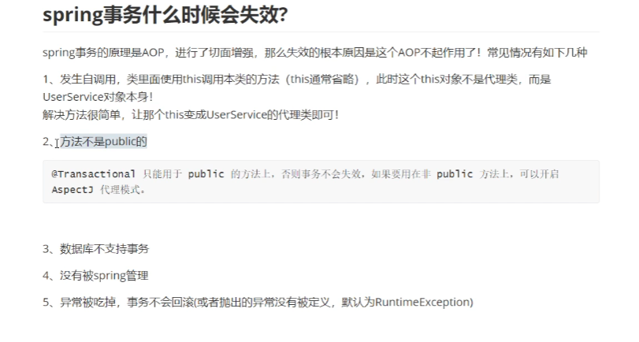
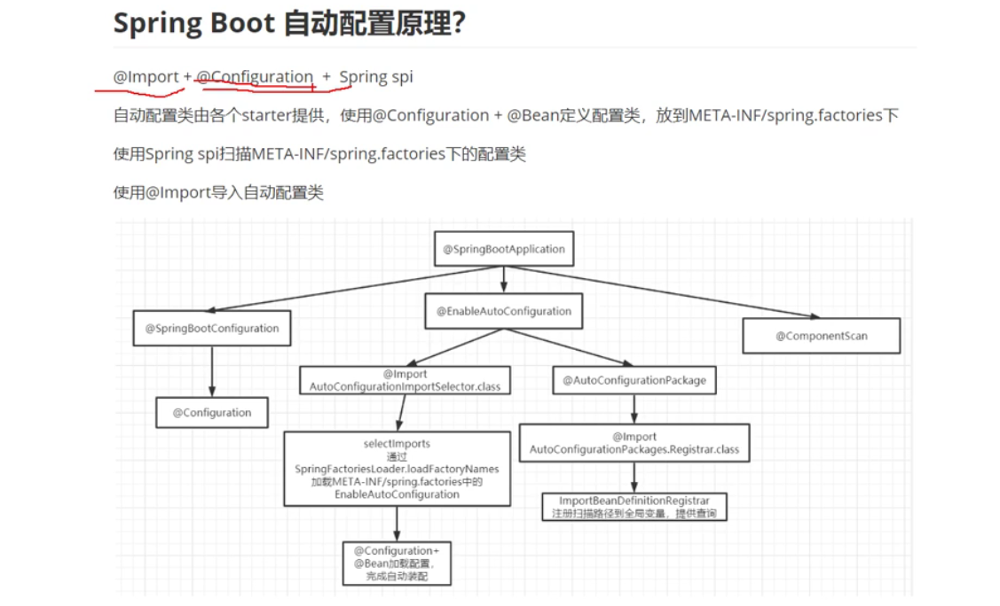
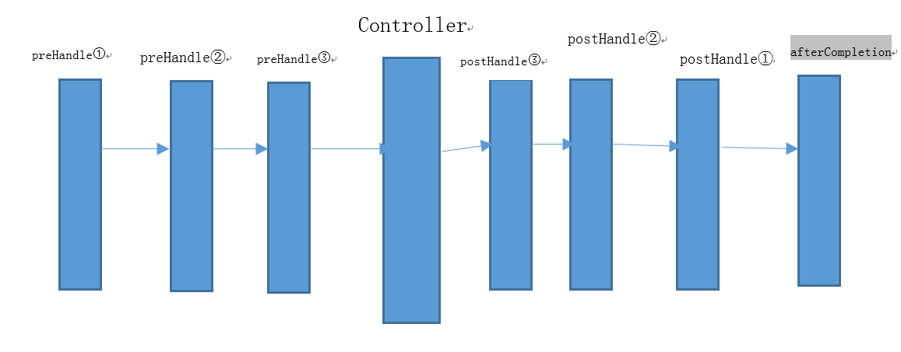
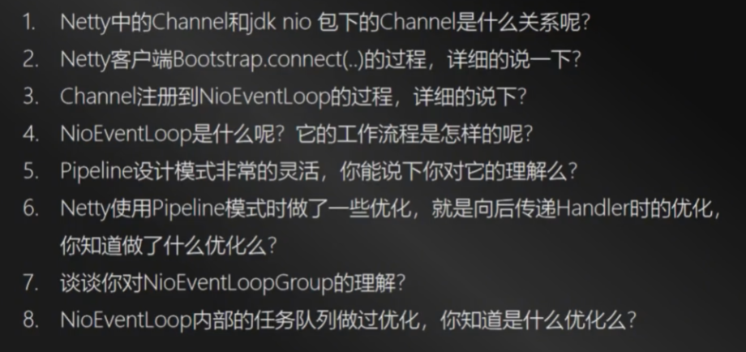

# springboot基础面试题

##  

## spring对bean的管理也是bean的生命周期

先调用构造函数进行实例化，然后填充属性，再接着进行其他附加操作和初始化，正是这样的生命周期，才有了Spring的解决循环依赖，这样的解决机制是根据Spring框架内定义的三级缓存来实现的，也就是说：三级缓存解决了Bean之间的循环依赖。

## spring bean的生命周期

spring bean的作用域

## spring事务

越往下效率越低， oracle默认为 rc级别，mysql默认为rr级别

## spring事务什么时候会失效

## springboot自动配置原理

## springmvc拦截器

**springMVC拦截器的实现一般有两种方式**

   第一种方式是要定义的Interceptor类要实现了Spring的HandlerInterceptor 接口

   第二种方式是继承实现了HandlerInterceptor接口的类，比如Spring已经提供的实现了HandlerInterceptor接口的抽象类HandlerInterceptorAdapter

HandlerInterceptor 接口中定义了三个方法，我们就是通过这三个方法来对用户的请求进行拦截处理的。

   **preHandle()**： 这个方法在业务处理器处理请求之前被调用，SpringMVC 中的Interceptor 是链式的调用的，在一个应用中或者说是在一个请求中可以同时存在多个Interceptor 。每个Interceptor 的调用会依据它的声明顺序依次执行，而且最先执行的都是Interceptor 中的preHandle 方法，所以可以在这个方法中进行一些前置初始化操作或者是对当前请求的一个预处理，也可以在这个方法中进行一些判断来决定请求是否要继续进行下去。该方法的返回值是布尔值Boolean 类型的，当它返回为false 时，表示请求结束，后续的Interceptor 和Controller 都不会再执行；当返回值为true 时就会继续调用下一个Interceptor 的preHandle 方法，如果已经是最后一个Interceptor 的时候就会是调用当前请求的Controller 方法。

   **postHandle()**：这个方法在当前请求进行处理之后，也就是Controller 方法调用之后执行，但是它会在DispatcherServlet 进行视图返回渲染之前被调用，所以我们可以在这个方法中对Controller 处理之后的ModelAndView 对象进行操作。postHandle 方法被调用的方向跟preHandle 是相反的，也就是说先声明的Interceptor 的postHandle 方法反而会后执行。

   **afterCompletion()**：该方法也是需要当前对应的Interceptor 的preHandle 方法的返回值为true 时才会执行。顾名思义，该方法将在整个请求结束之后，也就是在DispatcherServlet 渲染了对应的视图之后执行。这个方法的主要作用是用于进行资源清理工作的。

## springmvc过程

https://www.jianshu.com/p/8a20c547e245

netty面试题

