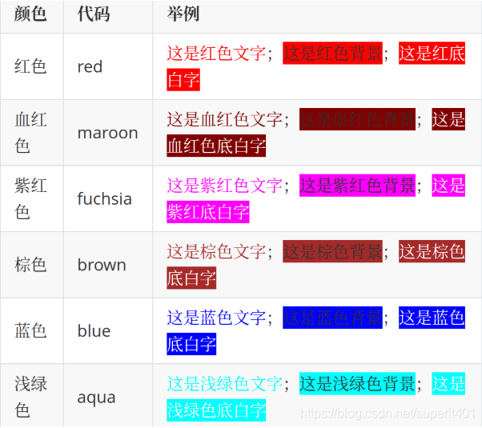

<font color=#ee1111>  fsfsf </font>

```javascript
简单字体颜色
<font color=#ee1111>  fsfsf </font>


```


<span style='color:red;background:blue;font-size:123;'>你好</span>

```javascript
<span style='color:文字颜色;background:背景颜色;font-size:文字大小;font-family:字体;'>文字</span>

```

style="color:red"

style="color:maroon"

style="color:fuchsia"

style="color:brown"

style="color:blue"

style="color:aqua"

style="color:green"

style="color:orange"

style="color:purple"

style="color:white;background:black;"

style="background:yellow"

style="background:red"

style="background:orange"

style="color:white;background:green"

style="color:white;background:blue"

